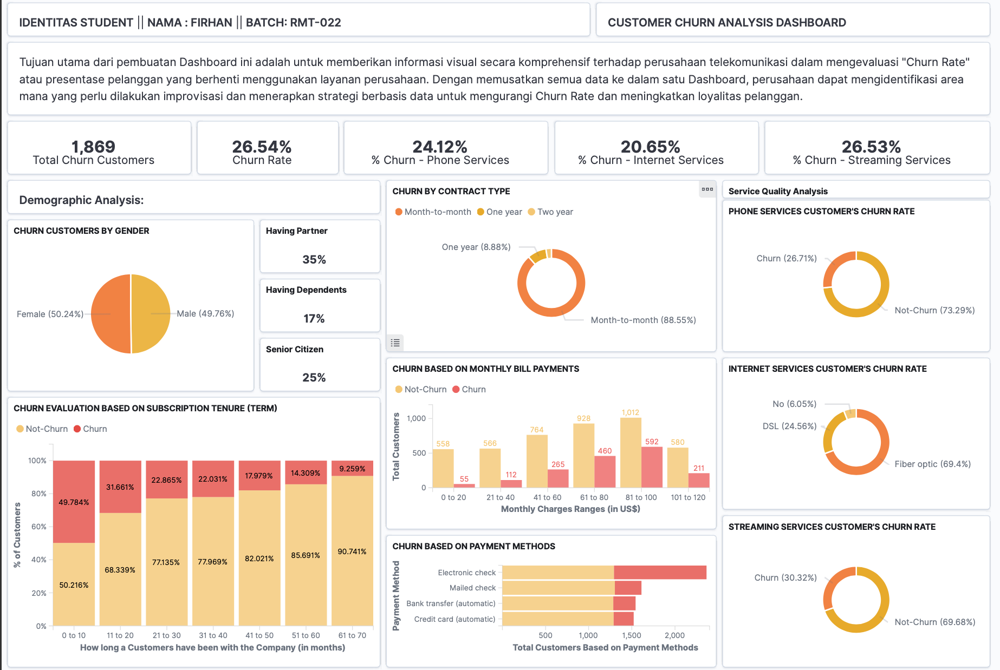

# Churn Rate Visualization Dashboard using Elasticsearch & Kibana	

## Table of Contents

- [Project Overview](#project-overview)
- [Data Sources](#data-sources)
- [Customer Churn Analysis Dashboard](#customer-churn-analysis-dashboard)

### Project Overview
---
Designed and developed a comprehensive data visualization dashboard focused on analyzing the "Churn Rate" for a telecommunications dataset sourced from Kaggle. Leveraged Python to extract and cleanse the data from a PostgreSQL database using Pandas, subsequently indexing it into Elasticsearch. The resulting Kibana dashboard centralizes key metrics, empowering the telecommunications company with actionable insights to reduce churn, identify improvement areas, and boost customer loyalty through data-driven decisions.

### Data Sources

The dataset used is data available on the Kaggle website, a dataset called *Telco Customer Churn* which contains information about transaction data and customer profiles from a telecommunications company domiciled in the United States. This data was obtained under license from the Kaggle website with the following [link](https://www.kaggle.com/datasets/blastchar/telco-customer-churn?datasetId=13996&sortBy=voteCount)

### Tools

- Pandas: for data manipulation and cleaning.
- PostgreSQL: is used as the primary data storage and retrieval system for the dataset.
- sqlalchemy: for extracting data from the PostgreSQL database.
- elasticsearch: for integrating the cleaned data into Elasticsearch, making it ready for visualization with Kibana.

### Data Cleaning and Manipulation

In the initial data cleaning and manipulation phase, I performed the following tasks:
- Removes duplicate rows
- adjusting data types
- correcting inconsistent data 
- transforming column names
- handling missing values

### Insert data into Elasticsearch
- Storing raw data in a PostgreSQL database
- Create a query to retrieve data from the database and transform it into a DataFrame
- Cleaning and manipulating data
- Save cleaned data into a CSV file
- Specify the csv directory file and create an Elasticsearch connection
- Create a name for the Elasticsearch index
- Dashboard visualization using Kibana

### Customer Churn Analysis Dashboard

The analysis results are summarized as follows:
1. About a quarter of the Customers have been leaving this telecommunication company, which is very bad rate. 
2. A majority of the telco customers are subscribed to a telephone service, with almost 27% of them churning.
3. Majority the customers who leave the company have been with the company for less than a year or can be considered as new customers.
4. Most customers who churn are on a monthly contract. Additionally, customers with higher monthly charges are more likely to churn.
5. The highest churn rate is among Fiber optic service users. This suggests that there may be issues with the fiber optic service, and churn is likely to increase among its subscribers.

### Recommendations

Based on the analysis, I recommend the following actions:
- Customer Retention Focus: With about a quarter of the customers leaving, it's vital to launch a targeted customer retention program. This could involve loyalty benefits, personalized offers, or enhanced customer service support to address concerns and enhance the overall customer experience.
- Investigate Short-term Customers: Since half of the customers who leave have been with the company for less than a year, it's crucial to investigate the primary pain points for new customers. Implement feedback mechanisms for new customers to understand their expectations. 
- Re-evaluate Monthly Contract Strategy: The high churn among monthly contract customers indicates potential dissatisfaction with the terms or perceived value. Consider revising the monthly contract offerings, providing incentives for longer-term contracts, or improving the clarity and communication around monthly contract benefits.
- Pricing Strategy Assessment: The data suggests customers with higher monthly charges are more likely to churn. It may be beneficial to reassess the pricing strategy, possibly introducing more competitive pricing tiers or bundling options that offer better perceived value to customers.
- Fiber Optic Service Review: The significant churn among fiber optic service users is concerning. It's essential to conduct a thorough review of the fiber optic service. This should include service reliability, speed consistency, customer support for this specific service, and competitive pricing compared to alternatives in the market. Feedback from churned customers can provide invaluable insights into the specific issues they faced.

### References
1. [PostgreSQL Manual](https://www.postgresql.org/docs/)
2. [Elasticsearch Documentation](https://www.elastic.co/guide/index.html?utm_campaign=B-Stack-Trials-APJ-Exact&utm_content=Stack-Documentation&utm_source=google&utm_medium=cpc&device=c&utm_term=elasticsearch%20documentation&gclid=Cj0KCQjwhL6pBhDjARIsAGx8D59FqTjkMeFbTdlfRVDDhDxDDYiPfx0qIIRX9EkaEbTSNdwx_c8BeD4aAhiyEALw_wcB)
3. [Kaggle](https://www.kaggle.com/datasets/blastchar/telco-customer-churn)

